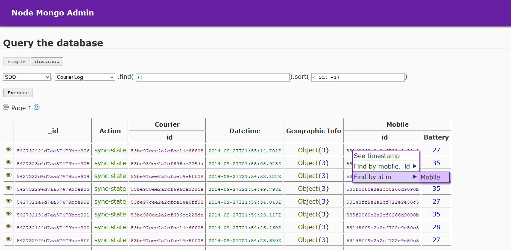

# Node Mongo Admin

A simple web application to visualize mongo data inspired by PHPMyAdmin

## Install
1. Clone this repo
2. Copy the file `example-config.js` to `config.js` and edit what you want
3. Start with `node index` or, if you have `forever`, `npm start`

## Features
* Multiple connections
* Table-like display
* HTTPs and BasicAuth
* Relaxed query language (accepts not only JSON, but also plain JS)

## Example

## TODO
* Edit documents
* Remove documents
* Manage collections
* Manage indexes
